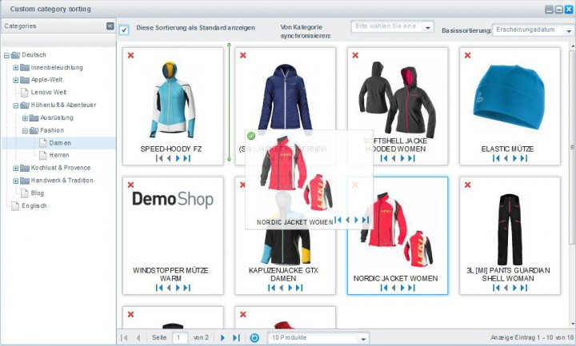

# SwagCustomSort

## Description 
Do you want to comletely customize the sort order of the article listing?

Special promotion articles or new articles should always be displayed on top?

Now you can define custom sortings with the "CustomSort" plugin.
You can move the articles via drag 'n' drop to their new position.
Instead of defining own sortings you have the ability to provide basic sorting methods and modify them.
This lets you create listings fast, effective and with just a few steps.

Did you already create a custom sorting and want to apply it to other categories?
No Problem! Simply synchronize the settings from the existing category. 
This allows you to use the listing settings for your language or sub shops without re-defining all settings again.
Of course you can choose whether the created sorting should be used as default or as additional sorting element.
The new sortings will be displayed in the frontend with their chosen name. The name can be declared in the plugin settings.

**Features:**

* custom sorting for all categories (independend from the category layer)
* sorting via Drag&Drop
* base sortings can be inherited
* setup a custom sorting as default sorting
* synchronize between categories (e.g language-shops)
* the amount of products is customizable for a better overview (from 10 to all articles)
* displaying as own sorting entry in the frontend

## Images

## License

The MIT License (MIT). Please see [License File](LICENSE) for more information.